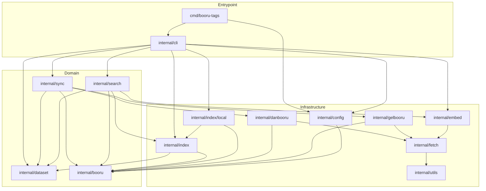

# Local tag dataset and RAG hybrid search

Status: Proposed. Nothing here is implemented.
Depends on: none; it supersedes the live `popular`, `tags`, `related`, `search`, and `get` tools.
Related: `AGENTS.md`, `README.md`, `.env.example`, `Dockerfile`, `.github/workflows/ci.yml`.

## Goal

Turn the project from a live MCP server over many boorus into a local, single-operator tool that builds its own tag
index:

1. Pull tags and their work counts from Danbooru, rule34, and Gelbooru, politely rate limited, and merge them into a
   local dataset file. The dataset is augmented and updated, never overwritten.
2. Embed each tag through an OpenAI-compatible embeddings endpoint.
3. Build a local hybrid index and answer three shapes of question: a natural-language prompt, a plain tag query, and a
   paged popular list. The answer is always tags.

The live server, the HTTP surface, authentication, and the MCP wire protocol go away. What remains is a CLI plus the
libraries behind it.

## Requirements recap

Stated by the owner:

- The live MCP of the boorus is replaced entirely by a local script.
- Pull from exactly Danbooru, rule34, and Gelbooru.
- Pulling is rate limited.
- Tags and their work count are saved to a local CSV or JSON file.
- An integration (pgvector or lighter) turns the dataset into RAG hybrid search.
- Search output is the tags related to the input query.
- Popular tags are still returnable, and paged.
- Searching tags normally, with a query rather than a prompt, works too. That is the hybrid aspect.
- The pull augments and updates the dataset; it does not overwrite it.
- Embeddings and any other model calls use an OpenAI-compatible endpoint plus an API key.
- Open questions are expected and should be recorded rather than guessed at silently.

## Non-goals

- No HTTP server, no MCP wire protocol, no per-request authentication. See Open questions; a thin local wrapper is a
  later possibility, not v1.
- No post search, post fetch, or image references. Posts, ratings, permalinks, and file URLs are out of the model.
- No scraping and no browser automation. Documented JSON APIs only.
- No hosted or multi-user deployment. One operator, one local dataset, one local index.
- No cross-corpus count summation. Counts stay per site.
- No shipping a blocked-tag list. The mechanism stays; the list does not.
- No tracking of tag co-occurrence or post history. The related-tag API and post payloads are dropped with the live
  server.

## Scope

In scope: `cmd/`, `internal/booru`, `internal/danbooru`, `internal/gelbooru`, `internal/fetch`, `internal/config`,
`internal/utils`, and new packages `internal/dataset`, `internal/sync`, `internal/embed`, `internal/index`,
`internal/index/local`, `internal/cli`. Also `README.md`, `.env.example`, `AGENTS.md`, `Dockerfile`, and
`.github/workflows/ci.yml`.

Out of scope: the historical plans under `docs/plans/done`, and the `.prototools` and `LICENSE` files.

## Design

### The three sites

| Site       | Family   | Tag listing      | Credentials                                        |
| ---------- | -------- | ---------------- | -------------------------------------------------- |
| `danbooru` | Danbooru | `GET /tags.json` | `DANBOORU_LOGIN` + `DANBOORU_API_KEY` (optional)   |
| `rule34`   | Gelbooru | `GET /index.php` | `RULE34_API_KEY` + `RULE34_USER_ID` (required)     |
| `gelbooru` | Gelbooru | `GET /index.php` | `GELBOORU_API_KEY` + `GELBOORU_USER_ID` (required) |

Danbooru selects `search[order]=count` and pages with the one-based `page`. The Gelbooru family sends `page=dapi`,
`s=tag`, `q=index`, `json=1`, `orderby=count`, and pages with the zero-based `pid`. `rule34` and `gelbooru` share the
`internal/gelbooru` adapter, as they do today, and that page-index asymmetry stays inside the adapters.

A site whose required credentials are unset is skipped by `sync` and named in the summary. It is not a fatal error, and
it does not stop the other sites. This mirrors the existing inactive-client rule.

Tag listing is always ordered by count descending. That is what lets `sync` stop early once counts fall below a
threshold, and it is what makes popular paging cheap.

### Dataset file

The dataset is the durable, portable artifact. It holds one record per `(site, tag)` pair:

```json
{
    "site": "danbooru",
    "tag": "blue_hair",
    "category": "general",
    "count": 482913,
    "first_seen": "2026-09-18T00:00:00Z",
    "updated_at": "2026-09-18T00:00:00Z"
}
```

The canonical format is JSONL, one record per line, sorted by `(site, tag)` on write. JSONL is chosen over CSV because
a record can gain fields without a format change, and because it streams. `export --format csv` produces the CSV form
for people who want to open it in a spreadsheet, with the header
`site,tag,category,count,first_seen,updated_at`.

Merge semantics, which are the whole point of "augment, not overwrite":

- Load the existing file, key it by `(site, tag)`.
- Apply incoming records: update `category`, `count`, and `updated_at`; keep the existing `first_seen`, or set it for a
  new row.
- Exchange direction: a count may go down between runs, because posts are deleted upstream. The latest fetched value
  wins; it is not a maximum.
- Rows absent from this run are preserved. A site that fails keeps its previous rows untouched.
- Write to a temporary file in the same directory and rename over the target, so a crash mid-write cannot truncate the
  dataset.

### Embeddings

One embedding per distinct tag name, not per `(site, tag)` pair. The same tag on three sites is one document, which
cuts embedding cost roughly in proportion to overlap and matches the dedupe-by-name shape of search results. Per-site
counts remain available from the dataset.

The embedded text is a deterministic function of the tag, kept in one place so it can be hashed:

```
EmbeddingText(record) = strings.ReplaceAll(name, "_", " ") + " [" + category + "]"
```

Both `model` and a hash of the text are stored next to each vector. A tag is re-embedded when either changes, which
makes a model swap or a template change a matter of rerunning `index`, not a manual purge.

The client talks to `POST {EMBEDDINGS_BASE_URL}/embeddings` with the OpenAI request and response shape, which is what
OpenAI, Ollama, llama.cpp, LM Studio, vLLM, and Text Embeddings Inference all speak. `dimensions` is sent only when
`EMBEDDINGS_DIMENSIONS` is set, because not every compatible server accepts it. Batches are configurable, and the
response is reordered by each item's `index` field rather than trusted to arrive in order. Token usage is summed and
logged per run, because that is the cost signal.

When `EMBEDDINGS_API_KEY` is unset, `index` refuses to run with a clear error and `search` degrades to lexical-only
with a notice in the output. A missing key never breaks the dataset or popular paths.

### Index

The index is one SQLite file, via the existing `modernc.org/sqlite` dependency. Two tables plus one FTS table:

```sql
CREATE TABLE tags (
    id         INTEGER PRIMARY KEY,
    site       TEXT    NOT NULL,
    name       TEXT    NOT NULL,
    category   TEXT    NOT NULL,
    "count"    INTEGER NOT NULL,
    first_seen INTEGER NOT NULL,
    updated_at INTEGER NOT NULL,
    UNIQUE (site, name)
);

CREATE TABLE tag_embeddings (
    name        TEXT    PRIMARY KEY,
    model       TEXT    NOT NULL,
    dims        INTEGER NOT NULL,
    input_sha   TEXT    NOT NULL,
    vector      BLOB    NOT NULL,
    embedded_at INTEGER NOT NULL
);

CREATE VIRTUAL TABLE tags_fts USING fts5(id UNINDEXED, tokens);
```

`tokens` is the tag name with underscores replaced by spaces, lowercased. That is what makes a lexical query for
"blue hair" match `blue_hair`. FTS5 availability is probed once at open; if the driver does not provide it, lexical
retrieval falls back to a `LIKE` scan and the CLI reports which path is active.

Vector retrieval is exact brute-force cosine similarity: stream `(name, vector)` rows for the active `model` and `dims`
from SQLite in chunks, keep a top-K heap. Memory stays bounded regardless of corpus size, and there is no new
dependency. At the corpus sizes this plan targets (see Risks) it is well under a second per query.

**Why not `sqlite-vec`.** Its Go bindings are cgo-only and target `mattn/go-sqlite3`, while this project uses pure-Go
`modernc.org/sqlite` and builds with `CGO_ENABLED=0`. Adopting it would mean changing the driver and the build. It is
recorded under Proposed additions instead.

**Why not pgvector by default.** It is heavier: a Postgres server, a schema, a connection, and a second thing to back
up, in exchange for approximate nearest neighbour speed this corpus does not need. The `Index` interface is the seam
that keeps it a swap rather than a rewrite, and it is recorded under Proposed additions.

The `internal/index` package holds the interface and result types; `internal/index/local` implements it over SQLite. A
future `internal/index/pgvector` implements the same interface.

### Hybrid search

Lexical and vector retrieval each return a ranked list. They are fused with weighted reciprocal rank fusion, reusing
the project's existing RRF convention (`k = 60`):

```
score(tag) = lexWeight * 1/(60 + rank_lexical) + vecWeight * 1/(60 + rank_vector)
```

Weights default to `1.0` and `1.0`. Mode selects them:

- `--mode hybrid`: both paths, equal weights.
- `--mode auto` (default): lexical-dominant (`2.0` / `1.0`) when the query is a single token or matches an existing tag
  name exactly, vector-dominant (`1.0` / `2.0`) otherwise. The intent is that a tag query behaves like the old `tags`
  tool, and a prompt behaves like semantic retrieval.
- `--mode lexical` and `--mode vector`: one path only, for debugging and for offline use.

Results dedupe by tag name across sites. Each result carries its category, the fused score, each contributing site's
count, and, with `--explain`, the rank each path gave it. Filters (`--site`, `--category`, `--min-count`) are applied
before ranking, in SQL for both paths, so the two paths see the same candidate set.

The query embedding is computed once per invocation. A small on-disk cache keyed by `(model, sha256(text))` avoids
paying for repeated identical queries; it is evicted by size, not by time.

### Popular with pages

`popular` pages over the indexed tags, ordered `count DESC, name ASC`, which is deterministic and therefore stable for
a fixed index snapshot. Without `--site`, it fuses across sites by tag name with `count = MAX(count)` and pages over
that fused list; `total` is the distinct-name count. With `--site`, it pages that site's own rows. OFFSET is used
rather than a cursor because a page number is the requested interface; a cursor is noted as a follow-up for consumers
that page while a sync is running.

### CLI

```
booru-tags sync     [--sites danbooru,rule34,gelbooru] [--min-count 100] [--max-pages 0]
                    [--data data/tags.jsonl] [--resume]
booru-tags index    [--data data/tags.jsonl] [--db data/index.db] [--min-count 100]
                    [--batch 100] [--limit 0]
booru-tags search   <query> [--mode auto] [--limit 25] [--site ...] [--category ...] [--min-count ...]
                    [--lex-weight 1.0] [--vec-weight 1.0] [--explain] [--json]
booru-tags popular  [--page 1] [--page-size 50] [--site ...] [--category ...] [--min-count ...] [--json]
booru-tags export   [--format jsonl|csv] [--out -] [--data data/tags.jsonl]
booru-tags stats    [--data data/tags.jsonl] [--db data/index.db]
```

Human-readable output goes to stdout; diagnostics and progress go to stderr, so `--json` stays machine-readable.
`--help` at the root and per subcommand exits 0. An unknown subcommand or flag exits 2 with usage.

### Configuration

| Envar                     | Default                     | Notes                                      |
| ------------------------- | --------------------------- | ------------------------------------------ |
| `DATA_PATH`               | `data/tags.jsonl`           | dataset file                               |
| `INDEX_PATH`              | `data/index.db`             | SQLite index                               |
| `SITES`                   | `danbooru,rule34,gelbooru`  | pull roster                                |
| `MIN_COUNT`               | `100`                       | tags below this are not pulled or embedded |
| `RATE_LIMIT_RPS`          | `1`                         | one global limiter for all booru calls     |
| `RATE_LIMIT_BURST`        | `1`                         |                                            |
| `REQUEST_TIMEOUT_SECONDS` | `20`                        |                                            |
| `USER_AGENT`              | `booru-mcp/0.1.0`           | sent on every booru request                |
| `DANBOORU_LOGIN`          | unset                       | optional                                   |
| `DANBOORU_API_KEY`        | unset                       | optional                                   |
| `GELBOORU_API_KEY`        | unset                       | required for `gelbooru`                    |
| `GELBOORU_USER_ID`        | unset                       | required for `gelbooru`                    |
| `RULE34_API_KEY`          | unset                       | required for `rule34`                      |
| `RULE34_USER_ID`          | unset                       | required for `rule34`                      |
| `EMBEDDINGS_BASE_URL`     | `https://api.openai.com/v1` | any OpenAI-compatible server               |
| `EMBEDDINGS_API_KEY`      | unset                       | enables `index` and the vector path        |
| `EMBEDDINGS_MODEL`        | `text-embedding-3-small`    |                                            |
| `EMBEDDINGS_DIMENSIONS`   | `0`                         | `0` means the server default               |
| `EMBEDDINGS_BATCH_SIZE`   | `100`                       |                                            |
| `EMBEDDINGS_RPS`          | `5`                         | separate limiter from the booru one        |
| `BLOCKED_TAGS`            | unset                       | applied at ingest and at query             |
| `LOG_LEVEL`               | `info`                      |                                            |

Removed by Unit 2: `HOST`, `PORT`, `API_KEY`, `BOORU_CLIENTS`, `DEFAULT_CLIENTS`, `DANBOORU_TIER`, `MAX_LIMIT`,
`CONTENT_RATING`, `CACHE_TTL_DAYS`, `DB_PATH`, `ERROR_DETAIL`.

Every secret is read from the environment only. No key is ever written to the dataset, the index, a log line, or a URL.
`EMBEDDINGS_API_KEY` and the booru credentials are sent as headers or query parameters exactly as each protocol
requires, and errors are redacted before they reach a message.

## Open questions

Each has a recommended default so implementation is not blocked. Answers get folded into Recorded decisions after
review.

1. **Vector backend.** Recommended: local SQLite brute-force cosine, which is the lightest option and keeps
   `CGO_ENABLED=0`. pgvector stays available behind the `Index` interface. Confirm, or choose pgvector outright.
2. **Embedding model and dimensions.** Recommended: `text-embedding-3-small` at the server default, configurable.
   The owner may prefer a local server (Ollama, TEI) or a different model.
3. **Corpus bound.** Recommended: `MIN_COUNT=100`, which keeps the embedded corpus small enough for exact search.
   Confirm the threshold, or choose a per-site cap.
4. **Dataset format.** Recommended: JSONL canonical plus CSV export. Confirm CSV as canonical instead, if that is the
   preference.
5. **Result shape.** Recommended: dedupe by tag name with per-site counts, matching the old `tags` tool. The
   alternative is one row per `(site, tag)`.
6. **Popular aggregation.** Recommended: fused by name across sites, `count = MAX`, with `--site` to page one site.
   The alternative is per-site rows only.
7. **Blocklist timing.** Recommended: apply `BLOCKED_TAGS` at ingest and again at query, so a blocked tag never enters
   the dataset and cannot leak through a stale index.
8. **Does anything need to consume this programmatically?** Recommended: CLI plus `--json` for v1. A thin stdio MCP
   server over the same `search` and `popular` calls is a small later addition and is recorded under Proposed
   additions.
9. **Scheduling.** Recommended: run `sync` then `index` manually or from cron; shipping a scheduler is out of scope.

## Architecture impact

The diagram in `AGENTS.md` is replaced. Only `internal/cli` constructs the concrete index backend; libraries do not
reach upward.



`internal/booru` stays the dependency-free leaf that holds the canonical tag types; it does not import `context` and
declares no interfaces. `internal/sync` owns the `TagSource` interface, so providers depend downward and never on the
sync engine.

Deleted by Unit 2: `internal/mcp`, `internal/server`, `internal/auth`, `internal/present`, `internal/catalog`,
`internal/store`, and `cmd/server`. Deleted by Unit 1: `internal/moebooru`. The MCP SDK, `chi`, `cors`, and
`jsonschema-go` leave `go.mod` with them.

## Implementation units

Units 3 and 6 are independent and can land in any order. Unit 1 precedes Units 2, 4, and 5. Units 7 and 8 precede
Units 9 to 11.

### Unit 1: Trim the roster to the three sites

Remove the Moebooru family: delete `internal/moebooru`, drop `FamilyMoebooru`, the three Moebooru specs, and the
`yandereURL`, `konachanURL`, and `sakugabooruURL` constants. Remove the `xbooru` and `safebooru` Gelbooru specs and
their constants. Remove the `KONACHAN_URL` override and the `URLEnv` machinery if no remaining client uses it.

Acceptance criteria:

- [ ] `clientSpecs` contains exactly `danbooru`, `gelbooru`, and `rule34`, and `BOORU_CLIENTS=xbooru` fails validation
      with an unknown-client error.
- [ ] `internal/moebooru` no longer exists, and no non-historical file references `moebooru`, `yandere`, `konachan`,
      `sakugabooru`, `xbooru`, or `safebooru`.
- [ ] The Danbooru client no longer reports itself as related-tag capable, because the related-tag tool is going away;
      `server.buildClients` no longer collects related clients.
- [ ] `go build ./...`, `go vet ./...`, and `go test ./... -race -count=1` pass.

### Unit 2: Retire the live server and add the CLI skeleton

Delete `internal/mcp`, `internal/server`, `internal/auth`, `internal/present`, `internal/catalog`, `internal/store`, and
`cmd/server`. Add `cmd/booru-tags` and `internal/cli`. Trim `internal/config` to the envars this tool uses and add
validation for the new ones. Trim `internal/booru` to the canonical types (`Tag`, `TagCategory`, `NormalizeTag`,
`Percent`); delete `post.go` and `provider.go`. Drop the MCP SDK, `chi`, `cors`, and `jsonschema-go` from `go.mod`.
Update `Dockerfile` to build `./cmd/booru-tags`, and update the CI workflow name and any step that references the old
entrypoint.

Acceptance criteria:

- [ ] No non-historical file imports `modelcontextprotocol/go-sdk`, `go-chi/chi`, `go-chi/cors`, or
      `google/jsonschema-go`, and none of those modules remain in `go.mod`.
- [ ] `go run ./cmd/booru-tags --help` exits 0 and prints every subcommand from Design; an unknown subcommand exits 2
      with usage, asserted by a test that calls `cli.Run` with captured writers.
- [ ] `config.Load().Validate()` rejects a non-positive `RATE_LIMIT_RPS`, a non-positive `EMBEDDINGS_RPS` when set, and
      an unknown `SITES` entry, and accepts the documented defaults.
- [ ] `Dockerfile` builds `./cmd/booru-tags` with `CGO_ENABLED=0`, and the image entrypoint is that binary.
- [ ] `go build ./...`, `go vet ./...`, and `go test ./... -race -count=1` pass.

### Unit 3: Dataset model and file store

Add `internal/dataset` with the `Record` type and a `Store` that reads, merges, and writes the JSONL file described in
Design, plus CSV export. Writes are atomic through a temp file and rename. The package has no network dependency and
does not import any provider.

Acceptance criteria:

- [ ] Merging run B into a store loaded from run A preserves every `(site, tag)` row from A that B does not mention,
      and updates `count`, `category`, and `updated_at` for rows B does mention, asserted by a table-driven test.
- [ ] A row's `first_seen` is set on insert and never changes on update; a count decrease is applied, not ignored.
- [ ] The written file is sorted by `(site, tag)` and round-trips through a second `Load` without loss.
- [ ] A failure injected between temp write and rename leaves the previous file byte-identical.
- [ ] CSV export writes the documented header and one row per record, and is covered by a golden file.

### Unit 4: Paged tag listing in the providers

Add a page-oriented listing to `internal/danbooru` and `internal/gelbooru`: given a 1-based page and a limit, return
tags ordered by count descending, mapped to the canonical model. Danbooru uses `search[order]=count` with `page`;
Gelbooru uses `orderby=count` with `pid = page - 1`. Both clamp the limit to their site maximum and return an empty
slice for a page past the end.

Acceptance criteria:

- [ ] `danbooru` sends `search[order]=count`, `limit`, and `page` only when `page > 1`, asserted against an `httptest`
      server and recorded in the existing fixture style.
- [ ] `gelbooru` sends `orderby=count` and `pid = page - 1`, asserted the same way.
- [ ] A tag's name, category, and count are normalized identically to the current adapters; Gelbooru's deprecated type
      6 is excluded, as it is today for popular tags.
- [ ] An empty response is a normal, non-error result, and the existing `-race` suite passes.

### Unit 5: Sync engine, checkpoints, and the `sync` command

Add `internal/sync` with the `TagSource` interface, a paged engine, a JSON sidecar checkpoint, and the `sync` command.
The engine walks each site's pages in count order, stops a site when a full page falls below `MIN_COUNT`, and writes
the merged result through `internal/dataset`. A site that fails is reported in the summary and does not abort the
others. `--resume` continues from the checkpoint's page per site.

Acceptance criteria:

- [ ] With a fake source, a site stops after the first page whose lowest count is under `MIN_COUNT`, and no later page
      is requested.
- [ ] `--max-pages` bounds the walk, and each site's checkpoint is updated after each committed page.
- [ ] A site returning an HTTP error is reported with its name and reason, the other sites still complete, and the
      process exits 0 with the failure in the summary; a test asserts the exit code and the summary text.
- [ ] A second `sync` with no upstream change leaves the dataset byte-identical, and one with a new tag adds only that
      row.
- [ ] `--resume` on a checkpointed run requests the recorded page first, asserted by the fake source's call log.

### Unit 6: OpenAI-compatible embeddings client

Add `internal/embed` with a batched client for `POST {base}/embeddings`, and add `fetch.PostJSON` to `internal/fetch`
so the client reuses the existing limiter, retry, timeout, and error machinery with its own limiter. The client sends
`dimensions` only when configured, reorders results by `index`, rejects a batch whose dimensions disagree with the
configured value, sums `usage`, and returns `ErrNotConfigured` when the API key is unset.

Acceptance criteria:

- [ ] A fake server returning items out of order yields vectors aligned to the request order, asserted by a test.
- [ ] A batch larger than `EMBEDDINGS_BATCH_SIZE` is split into the expected number of requests, and a 429 is retried
      through the shared retry path.
- [ ] An inconsistent dimension across a batch is an error naming the two values, and a response whose vector length
      disagrees with `EMBEDDINGS_DIMENSIONS` is rejected.
- [ ] `ErrNotConfigured` is returned with no API key, and no credential appears in any error string, asserted by a
      test that greps the formatted error.
- [ ] Token usage is reported to the caller for logging.

### Unit 7: SQLite index store

Add `internal/index` (interface and result types) and `internal/index/local` (SQLite implementation) with the schema
in Design. The store upserts tags from dataset records idempotently, stores embeddings keyed by name with `model`,
`dims`, and `input_sha`, and exposes which names need an embedding for a given `(model, dims, text-hash)` tuple.
Journal mode follows the current `wal`-then-`delete` fallback.

Acceptance criteria:

- [ ] Upserting the same records twice leaves row counts and contents unchanged, asserted by a test.
- [ ] A tag removed from the dataset is retained in the index, matching the augment rule.
- [ ] `PendingEmbeddings` returns a name whose row is missing and a name whose `model`, `dims`, or `input_sha` changed,
      and no other name.
- [ ] The FTS5 probe sets a `LexicalMode` of `fts5` or `like`, and a test forces each path and asserts the same result
      order for a fixed fixture.

### Unit 8: Lexical and vector retrieval

Implement `Lexical` and `Vector` over the SQLite index. `Lexical` rewrites a query for the `_`/space mismatch and
ranks with `bm25` when FTS5 is present, and with a deterministic `count DESC, name ASC` order on the `LIKE` fallback.
`Vector` streams vectors for the active `model` and `dims`, computes cosine similarity, and returns a top-K heap.
Both apply the site, category, and min-count filters in SQL first.

Acceptance criteria:

- [ ] A query for `blue hair` matches `blue_hair` on the FTS5 path and on the `LIKE` path, asserted separately.
- [ ] Cosine similarity matches hand-computed values for a fixed set of small vectors within `1e-6`, and ties break
      deterministically by name.
- [ ] Top-K returns exactly `min(k, len(corpus))` hits and never more, asserted with `k` below and above the corpus
      size.
- [ ] A filter for one site excludes rows from the others on both paths, asserted by a test with a two-site fixture.
- [ ] Memory is bounded: the vector path is asserted never to buffer the full corpus, by reading through an interface
      that counts live rows in the streaming test double.

### Unit 9: `index` command

Implement the `index` command: load the dataset, upsert tags, compute the pending embedding set, embed it in batches,
and write vectors back. `--limit` bounds a single run so a large corpus can be walked in pieces. Progress and token
usage go to stderr. Running it twice in a row performs no embedding calls the second time.

Acceptance criteria:

- [ ] A second run against a fake embeddings server makes zero requests, asserted by the server's call count.
- [ ] Changing `EMBEDDINGS_MODEL` re-embeds every tag; changing only the embedding text template re-embeds every tag;
      neither path touches tags whose inputs are unchanged, asserted by call counts.
- [ ] `--limit 10` embeds exactly 10 tags and a subsequent run continues with the next batch.
- [ ] With no API key the command exits non-zero with a message that names `EMBEDDINGS_API_KEY`, and the index is
      unchanged.
- [ ] Summed token usage is printed once at the end of a run.

### Unit 10: Hybrid fusion and the `search` command

Add `internal/search` with weighted RRF fusion and the `search` command: embed the query once, run the selected path
or paths, fuse, dedupe by tag name, and render text or `--json`. `auto` selects weights as described in Design. With no
embeddings key the vector path is unavailable and the command completes lexically, printing a notice on stderr.

Acceptance criteria:

- [ ] Fusion matches a hand-computed expected ordering for a fixed pair of ranked lists, including a tag present on
      only one path.
- [ ] `--mode auto` picks lexical-dominant weights for a single-token query and for a query that exactly matches a
      stored tag name, and vector-dominant weights for a multi-word prompt, asserted by a table-driven test.
- [ ] Duplicate tag names across sites appear once, with every site's count preserved.
- [ ] `--explain` reports each path's rank and score for every result, and `--json` output validates against a golden
      schema.
- [ ] With no API key, `search` still returns lexical results and writes the degradation notice to stderr, not stdout.

### Unit 11: Paged popular

Implement the `popular` command over the index, with the fused and site-filtered orderings and the `--page`,
`--page-size`, `--total` fields from Design.

Acceptance criteria:

- [ ] Pages are disjoint and cover the ordered set exactly once across `ceil(total / page_size)` calls, asserted by a
      test that walks every page of a fixed fixture.
- [ ] Ordering is `count DESC, name ASC`; a tie on count is broken by name, asserted by a test with tied counts.
- [ ] `--site` pages only that site's rows, and its `total` differs from the unfiltered total.
- [ ] `--page 0`, a negative page, and a page past the end each produce a clear error or an empty page, as documented.
- [ ] `--json` emits `page`, `page_size`, `total`, and `tags`.

### Unit 12: Documentation, architecture, and deployment

Rewrite `README.md` around the CLI and the data flow, showing a full `sync` then `index` then `search` walkthrough.
Update `.env.example` to the table in Design, dropping the removed envars. Update `AGENTS.md`: replace the architecture
diagram with the one in this plan and rewrite the architecture prose. Update `Dockerfile` and CI so the image builds
and the tests run with no server surface.

Acceptance criteria:

- [ ] `README.md` no longer mentions MCP, HTTP, `API_KEY`, posts, images, or per-client tool calls, and documents
      `sync`, `index`, `search`, `popular`, `export`, and `stats`.
- [ ] `.env.example` contains every envar in the Design table and none of the removed ones.
- [ ] The `AGENTS.md` diagram matches the package graph in this plan, and a reader can follow it to the `Index`
      interface seam.
- [ ] `docker build .` succeeds, and `docker run <image> --help` exits 0.
- [ ] CI passes on the final tree, including `gofmt -l .`, `go vet ./...`, and `go test ./... -race -count=1`.

## Verification

Automated, on the final tree:

- `gofmt -l .`, `go build ./...`, `go vet ./...`, and `go test ./... -race -count=1` pass.
- `grep` finds no reference to a deleted package or to a removed client outside `docs/plans/done`.
- The dataset merge, checkpoint resume, embedding order, cosine, fusion, and paging tests run against fixtures and
  fakes, with no network.

Human, requiring real credentials and network:

- Configure `DANBOORU_*`, `GELBOORU_*`, and `RULE34_*`, then run `sync` with the default `RATE_LIMIT_RPS=1` and confirm
  the observed request rate is roughly one per second, the run is resumable after an interrupt, and the summary
  accounts for every site.
- Point `EMBEDDINGS_BASE_URL` at the intended endpoint, run `index`, and confirm the printed token usage and billed
  cost match expectations for the embedded corpus size.
- Search a prompt ("girl on a rooftop at night") and a tag query (`blue_hair`) and judge whether the returned tags are
  useful; confirm `auto` changes behaviour between the two, and `--explain` shows why each result ranked.
- Page through `popular` and confirm no tag repeats or is skipped across page boundaries within one index snapshot.
- Confirm the dataset file is valid JSONL after a mid-run kill, and that a second `sync` adds rows without removing
  any.

## Risks and follow-ups

- **Corpus size drives everything.** Embedding cost, index size, and query latency all scale with the number of tags
  above `MIN_COUNT`. The defaults are chosen for exact search to stay fast; raising the corpus without moving to an
  approximate index is the main way this design degrades.
- **Upstream pagination caps.** Danbooru limits how deep `page` may go for some account tiers, and both Gelbooru-family
  sites cap `limit`. With `MIN_COUNT` filtering and a falling count order, a run should never need the deep pages, but
  the caps are real and must be confirmed at implementation time rather than assumed.
- **Counts drift and are per site.** A tag's count is a snapshot from its own site and is not comparable across
  corpora. Nothing in this plan sums them; the fused popular `MAX` is an ordering device, not a total.
- **Embedding quality is unproven.** Tag names are short and idiosyncratic, and the exact text template is a guess
  until it is measured against real queries. The `input_sha` mechanism makes a template change cheap to apply, but the
  template itself is the first thing to tune.
- **SQLite is a single writer.** Sync, index, and search must not run concurrently against the same file; the CLI
  should detect an in-progress index build and refuse rather than corrupt or block.
- **NSFW tag text lands on disk in cleartext** in the dataset and the index. That is inherent to the product; the plan
  documents it rather than pretending the files are safe to share.
- **Blocklist ordering matters.** Applying `BLOCKED_TAGS` only at query time would leave blocked names in the dataset
  and in the embedding corpus; the plan applies it at ingest as well, which means changing the list requires a re-sync
  to take effect everywhere.

## Proposed additions

Cheap to add later because the seams already exist.

- `internal/index/pgvector`: the same `Index` interface over Postgres, for a corpus that outgrows exact search or an
  operator who already runs Postgres.
- `sqlite-vec`: only if the project is willing to switch SQLite drivers and take on cgo; the pure-Go build is the
  reason it is excluded today.
- A pure-Go HNSW index behind the same interface, if exact search latency becomes the bottleneck before a server
  database is justified.
- A thin stdio MCP server that exposes `search` and `popular` over the local index, restoring model-facing access
  without restoring any live booru calls.
- Count deltas and a trend view, since `updated_at` plus `count` already give a per-run difference; useful for
  "rising tags" ordering.
- Co-occurrence-aware embeddings, using the dropped related-tag capability to enrich each tag's embedded text.
- A keyset cursor for `popular`, for consumers that page while a `sync` is running.
