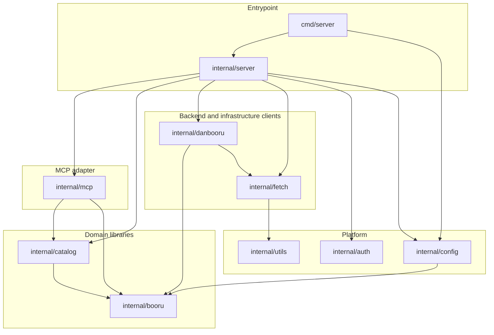

# Single-client tag search: Danbooru and one tool

Status: Done. All six units are implemented. A live smoke check against Danbooru confirmed the multi-word search, the
category mapping, and paging continuity. The remaining human checks under Verification are still outstanding, and the
container AC in Unit 6 could not be run here because the local Docker daemon is not accessible; the equivalent build
was verified with `CGO_ENABLED=0 go build` plus a binary smoke test of `/healthz` and `/mcp`.
Depends on: none.
Related: `AGENTS.md`, `README.md`, `.env.example`, `Dockerfile`, `.github/workflows/ci.yml`.

## Goal

Reduce the server to the smallest thing that is useful against live data: one MCP server, one client, one tool.

`tags` searches Danbooru tag names and returns the matches ordered by work count. It takes three arguments: `search`
(required), `offset` and `limit` (optional). It calls Danbooru live on every call, returns precisely the requested
window of the match list, and says whether more matches exist beyond it.

Everything else goes: Gelbooru and the other sites, the `popular`, `related`, `search`, and `get` tools, posts, images,
ratings, related tags, per-client status, the client registry, and the SQLite tag cache.

## Requirements recap

Stated by the owner:

- Keep it usable with live data; this is an MCP server, not a local dataset pipeline.
- One client: Danbooru. No Gelbooru.
- One tool: `tags`.
- `tags` has one required argument, `search`, and two optional arguments, `offset` and `limit`.
- With `search`, it queries the API to determine whether there are matching tags.
- Keep it simple. Nothing else is wanted from this server for now.

## Non-goals

- No Gelbooru, rule34, xbooru, safebooru, yandere, konachan, sakugabooru, or any other site.
- No `popular`, `related`, `search`, or `get`. The removed capability stays available in git history and in the
  completed plans under `docs/plans/done`.
- No post, image, permalink, or file URL handling. The server returns tags, not uploads.
- No persistence and no cache. Every call is live.
- No per-client status or client registry. One client cannot be partially available, so a failure is just an error.
- No rating filter, no tag-count tier cap, and no cross-site merging or fusion.
- No scraping and no browser automation. The documented JSON API only.
- No shipping a blocked-tag list. The mechanism stays; the list does not.

## Scope

In scope: `internal/mcp`, `internal/catalog`, `internal/booru`, `internal/danbooru`, `internal/config`,
`internal/server`, `internal/fetch`, `cmd/server`, their tests, `README.md`, `.env.example`, and `AGENTS.md`.

Deleted by this plan: `internal/gelbooru`, `internal/moebooru`, `internal/store`, and `internal/present`.

Out of scope: `internal/auth` and `internal/utils`, which are unchanged, and the historical plans under
`docs/plans/done`.

## Design

### One client

| Client     | Base URL                     | Adapter             | Credentials                                      |
| ---------- | ---------------------------- | ------------------- | ------------------------------------------------ |
| `danbooru` | `https://danbooru.donmai.us` | `internal/danbooru` | `DANBOORU_LOGIN` + `DANBOORU_API_KEY` (optional) |

Danbooru answers without credentials, so the server needs no setup beyond `API_KEY`. Credentials are still worth
setting: anonymous callers are throttled harder and are more likely to see a 429.

With one client, the roster machinery is dead weight. `ClientSpec`, `Family`, the client registry,
`EnabledClients`, `DefaultClients`, `ClientActive`, and the inactive-client path are all removed: there is exactly one
provider, constructed at startup. A failed call is returned as an error rather than as one entry in a per-client status
list.

### The `tags` tool

| Argument | Type   | Required | Default | Bounds                                           |
| -------- | ------ | -------- | ------- | ------------------------------------------------ |
| `search` | string | yes      |         | at least one letter or digit after normalization |
| `offset` | int    | no       | `0`     | `0` to `MAX_OFFSET`                              |
| `limit`  | int    | no       | `25`    | `1` to `MAX_LIMIT`                               |

`search` is a literal substring match against tag names, not a query language. It is normalised as
`booru.NormalizeTag` already normalises it: trimmed, lowercased, and internal whitespace collapsed to `_`. A search for
`blue hair` becomes `blue_hair`, which is how Danbooru stores it. The wildcard metacharacters `*` and `?` are stripped
from the input, so a search is always a literal substring and never an expression. A `search` that normalises to
nothing, or to something with no letter or digit in it, is rejected with an actionable message rather than being sent
as a match-everything pattern.

`offset` and `limit` apply to Danbooru's count-ordered match list. The tool returns exactly the window
`[offset, offset+limit)`, or a shorter final window when the matches run out.

The response echoes the request and carries the window:

```json
{
    "search": "blue_hair",
    "offset": 0,
    "limit": 25,
    "more": true,
    "tags": [
        { "name": "blue_hair", "category": "general", "count": 482913 },
        { "name": "blue_hair_ribbon", "category": "general", "count": 2100 }
    ]
}
```

`more` reports whether at least one match exists beyond the returned window. It is computed exactly, by reading one
item past the window rather than by guessing from a short page, so a caller can page until `more` is `false` without
ever losing or repeating a tag. An empty `tags` array with `more: false` is the definitive "no matching tags" answer.

An upstream failure is a tool error carrying the existing typed transport message, which already names the client, the
path, the status, and a bounded body excerpt. A failure never returns a partial result presented as a complete one.

### Query rendering

Danbooru stores tag names with underscores, so the canonical underscore form from `search` is sent as-is:

- `search[name_matches]=*blue_hair*`
- `search[order]=count`
- `limit` and `page`

The `*` characters in that pattern are the adapter's, not the caller's; the caller's are stripped first.

Results drop empty-named rows, which the live tag listing contains in count order, and map Danbooru's numeric
categories onto the canonical set: general, artist, copyright, character, meta.

### Paging

Danbooru's tag API is page-based, not offset-based, so the adapter maps the requested window onto the pages it needs:

- The internal page size is `min(MAX_LIMIT, 100)`, independent of the requested `limit`.
- The pages read are `offset / pageSize` through `(offset + limit - 1) / pageSize`, capped at two pages.
- The window is then sliced out of the concatenated pages, and the extra item that detects `more` is read from the
  page that follows when the window ends on a page boundary.

A fixed page size keeps the page index small: with the defaults, an `offset` of 1000 reads page 10, well inside
Danbooru's page depth cap for any account tier. Danbooru's `page` is one-based.

### Configuration

| Envar                     | Default           | Notes                                                 |
| ------------------------- | ----------------- | ----------------------------------------------------- |
| `HOST`                    | `0.0.0.0`         | unchanged                                             |
| `PORT`                    | `8080`            | unchanged                                             |
| `API_KEY`                 | unset             | required; bearer auth on `/mcp`, unchanged            |
| `LOG_LEVEL`               | `info`            | unchanged                                             |
| `ERROR_DETAIL`            | `useful`          | unchanged                                             |
| `USER_AGENT`              | `booru-mcp/0.1.0` | sent on every upstream request                        |
| `RATE_LIMIT_RPS`          | `1`               | one limiter for the one client                        |
| `RATE_LIMIT_BURST`        | `1`               |                                                       |
| `REQUEST_TIMEOUT_SECONDS` | `20`              |                                                       |
| `MAX_LIMIT`               | `100`             | caps `limit`, and therefore the internal page size    |
| `MAX_OFFSET`              | `1000`            | caps `offset`                                         |
| `DANBOORU_LOGIN`          | unset             | optional; raises the anonymous rate limit             |
| `DANBOORU_API_KEY`        | unset             | optional                                              |
| `BLOCKED_TAGS`            | unset             | comma-separated; matched tags are omitted from output |

Removed: `BOORU_CLIENTS`, `DEFAULT_CLIENTS`, `DANBOORU_TIER`, `CONTENT_RATING`, `CACHE_TTL_DAYS`, `DB_PATH`,
`GELBOORU_API_KEY`, `GELBOORU_USER_ID`.

`BLOCKED_TAGS` survives as a post-fetch filter on returned names, because it is the only content control left that
applies to a tag-name-only tool. Negation in a query is meaningless here, so only the filter half of the existing
mechanism remains.

## Recorded decisions

Owner decisions from the plan review, recorded so later changes do not relitigate them:

1. One client: Danbooru. Gelbooru and the other sites are removed.
2. One tool: `tags`, with `search`, `offset`, and `limit`.
3. No `site` argument, because there is only one site to query.
4. The output is a single flat tag list; a per-site grouping has nothing to group.

## Open questions

Each has a recommended default so implementation is not blocked.

1. **Defaults and bounds.** Recommended: `limit` default 25, `MAX_LIMIT` 100, `MAX_OFFSET` 1000, and an internal page
   size of 100. Confirm, or state a preferred `limit`.
2. **Removing the other four tools outright.** Recommended: yes, deleted rather than left registered. The owner said
   `tags` is all that is wanted for now, and an unregistered-but-present tool is dead code.
3. **Removing the roster machinery outright.** Recommended: yes, rather than leaving the registry and per-client status
   in place for a hypothetical second client. `docs/plans/done` records how it worked if a second client returns.
4. **Dropping the cache.** Recommended: yes, so every call is live, and `internal/store` plus the SQLite dependency go
   with it. A short-TTL in-memory cache is recorded under Proposed additions if live latency becomes annoying.

## Architecture impact

The diagram in `AGENTS.md` shrinks to one provider and loses `store`, `moebooru`, `gelbooru`, and `present`:



`internal/booru` shrinks to the tag model plus one interface: the provider contract, reduced to a paged tag search, and
the page it returns. Post, rating, related-tag, capability, registry, entry, and client-status types are deleted with
the tools that used them. `catalog` stays the domain layer that owns the limit clamps and the blocked-tag filter, and
it stays provider-agnostic; `server` constructs the one concrete provider. `internal/present` is folded into
`internal/mcp`, since it is the rendering for the single tool.

## Implementation units

Units 1 to 3 are a removal sequence and should land in that order. Units 4 to 6 follow Unit 3.

### Unit 1: Trim to the Danbooru client

Delete `internal/gelbooru`, `internal/moebooru`, and their tests. Remove `Family`, `ClientSpec`, `clientSpecs`,
`ClientSpecs`, `ClientSpecByName`, `EnabledClients`, `DefaultClients`, `ClientActive`, `ClientURL`, and the URL
constants that only removed clients used. Drop the `GELBOORU_*` envars from `Config` and move the two Danbooru
credentials onto `Config` as parsed fields, so `Config.Env` can go with the roster. Collapse `server.buildClients` and
`server.buildProvider` into constructing the one Danbooru provider.

Acceptance criteria:

- [x] `internal/gelbooru` and `internal/moebooru` no longer exist, and no non-historical file references `gelbooru`,
      `rule34`, `xbooru`, `safebooru`, `yandere`, `konachan`, `sakugabooru`, `Family`, or `ClientSpec`.
- [x] `Config` has no roster fields, `DANBOORU_LOGIN` and `DANBOORU_API_KEY` are parsed `Config` fields, and no
      file reads `GELBOORU_API_KEY` or `GELBOORU_USER_ID`.
- [x] `server.New` constructs exactly one provider, and a startup with no `DANBOORU_*` credentials succeeds.
- [x] `go build ./...`, `go vet ./...`, and `go test ./... -race -count=1` pass.

### Unit 2: Reduce the MCP surface to `tags`

Remove the `popular`, `related`, `search`, and `get` tools end to end: their MCP registrations, handlers, schemas, and
output types; their catalog methods; and the post, rating, related-tag, and capability types in `internal/booru` that
only they used. Delete the client registry, entries, per-client status, and skipped-client machinery, and delete
`internal/catalog/fuse.go`, `internal/catalog/policy.go`, `internal/catalog/popular.go`, `internal/catalog/related.go`,
`internal/catalog/search.go`, `internal/catalog/get.go`, `internal/catalog/clients.go`, `internal/booru/post.go`,
`internal/booru/provider.go`'s registry half, and `internal/present` in full, moving the tag text rendering into
`internal/mcp`.

Acceptance criteria:

- [x] A `tools/list` call against the server returns exactly one tool, named `tags`.
- [x] No non-historical file references `booru.Post`, `booru.Rating`, `booru.RelatedTag`, `booru.Capabilities`,
      `Registry`, `Entry`, `ClientStatus`, `ClientState`, `Skipped`, `SearchParams`, `PopularQuery`, or
      `RelatedTagProvider`.
- [x] `internal/present` and `internal/catalog/clients.go` no longer exist, and `catalog.Service` has no `resolve`
      method and no status accumulation.
- [x] An upstream error from the provider is returned by `catalog.Tags` as an error, not as a per-client status.
- [x] `go build ./...`, `go vet ./...`, and `go test ./... -race -count=1` pass.

### Unit 3: Remove the tag cache

Delete `internal/store` and its tests. Remove `DB_PATH` and `CACHE_TTL_DAYS` from `internal/config`. Remove the `store`
field and `CacheTTL` option from `catalog.Service` and have the tag path call the provider directly. Remove the SQLite
open, the journal-mode fallback, and the WAL warning from `internal/server`. Drop `modernc.org/sqlite` and its
transitive dependencies from `go.mod`.

Acceptance criteria:

- [x] `internal/store` no longer exists, and `go.mod` no longer requires `modernc.org/sqlite` or any `modernc.org/*`
      module.
- [x] A `tags` call makes exactly one upstream request, asserted by counting requests in an `httptest` server.
- [x] No non-historical file references `CACHE_TTL_DAYS`, `DB_PATH`, `UpsertTags`, `ReplacePopular`, or `CachedTag`.
- [x] `server.New` opens no database and logs no journal-mode warning, and the server still shuts down cleanly.
- [x] `go build ./...`, `go vet ./...`, and `go test ./... -race -count=1` pass.

### Unit 4: Exact paged tag search in the Danbooru adapter

Reduce the provider contract to a paged tag search:

```go
type TagQuery struct {
    Search string
    Offset int
    Limit  int
}

type TagPage struct {
    Tags []Tag
    More bool
}
```

Implement it in `internal/danbooru` using the query rendering and page mapping from Design. `More` is computed by
reading exactly one item past the window. The adapter stops treating a search as a pattern: `*` and `?` are stripped
before rendering.

Acceptance criteria:

- [x] Against a fixture of ordered tags, `offset: 30, limit: 25` returns exactly items 30 through 54, in count order,
      and the request sent carries the page numbers the mapping implies.
- [x] `More` is `true` when the fixture has an item past the window and `false` when the window ends exactly at the
      last item, asserted at that boundary.
- [x] A window that straddles a page boundary issues at most two requests, asserted by a request counter, and returns a
      full `limit` of items.
- [x] A search of `blue hair` sends `search[name_matches]=*blue_hair*`, `search[order]=count`, and the derived `limit`
      and `page`.
- [x] A search of `*blue?%hair*` sends only the literal substring form, asserted against the recorded query.
- [x] Empty-named rows are dropped, and every category code maps to its canonical value.
- [x] `go test ./... -race -count=1` passes.

### Unit 5: The `tags` tool contract

Reshape the catalog call and the MCP tool to the three-argument contract from Design. `catalog.Tags` takes `Search`,
`Offset`, and `Limit` and returns the tags plus `more`. The MCP schema has exactly the three properties, with `search`
required, defaults for the optional fields, and every bound validated before a call is made. The text and structured
outputs both present the flat shape.

Acceptance criteria:

- [x] The `tags` input schema has exactly `search`, `offset`, and `limit`, with `search` in `required` and defaults of
      `0` and `25`; `clients`, `category`, `refresh`, and `site` are absent.
- [x] A missing, empty, or punctuation-only `search` is rejected before any upstream call, asserted with a request
      counter of zero.
- [x] `offset: -1`, `offset: 1001`, `limit: 0`, and `limit: 101` are each rejected with a message naming the bound.
- [x] A response carries `search`, `offset`, `limit`, `more`, and `tags`, with each tag carrying `name`, `category`,
      and `count`.
- [x] A tag named in `BLOCKED_TAGS` is absent from the returned tags.
- [x] An upstream failure surfaces as a tool error whose message names the client and the failure, and no partial
      result is returned.
- [x] `go test ./... -race -count=1` passes.

### Unit 6: Documentation and configuration

Rewrite `README.md` around the single tool: what it does, the three arguments, the response, the optional Danbooru
credentials, and a copy-pasteable example. Update `.env.example` to the Design table and drop the removed envars.
Update `AGENTS.md` with the trimmed diagram and the reduced-prose architecture section.

Acceptance criteria:

- [x] `README.md` documents only `tags`, and no longer describes `popular`, `related`, `search`, `get`, posts, image
      URLs, Gelbooru, or the tag cache.
- [x] `README.md` states that Danbooru works without credentials, that credentials raise the rate limit, and that
      setting them is recommended.
- [x] `.env.example` contains every envar in the Design table and none of the removed ones.
- [x] The `AGENTS.md` diagram has no `store`, `moebooru`, `gelbooru`, or `present` node, and matches the packages that
      exist.
- [ ] `docker build .` succeeds and the image starts with `API_KEY` set. Not run: the local Docker daemon is not
      reachable from this environment. `CGO_ENABLED=0 go build -trimpath -ldflags="-s -w" ./cmd/server` and a binary
      smoke test of `/healthz` and unauthenticated `/mcp` were run instead.

## Verification

Automated, on the final tree:

- `gofmt -l .`, `go build ./...`, `go vet ./...`, and `go test ./... -race -count=1` pass.
- `grep` finds no reference to a deleted tool, type, envar, package, or client outside `docs/plans/done`.
- The paging window, the `More` boundary, the query rendering, the bounds validation, and the blocked-tag filter are
  covered by tests with no network.

Human, requiring live upstreams:

- Start the server with only `API_KEY` set and call `tags` with `search: "blue hair"`. Confirm matches come back from
  Danbooru with no credentials configured, that `blue_hair` is among them, and that the counts look plausible. This is
  the multi-word normalization check.
- Call `tags` with `search: "1girl"`, then repeat with `offset: 25` and `offset: 50`, and confirm each page continues
  where the previous stopped with no repeated or skipped tag, and that `more` is `true` until the last page.
- Call `tags` with a search that cannot match anything, and confirm an empty `tags` array with `more: false` rather than
  an error.
- Set `MAX_LIMIT=10` and confirm `limit: 11` is rejected before any upstream request appears in the logs.
- Watch the upstream request rate on a call with `offset: 0, limit: 100` and confirm it stays at the configured rate,
  and that a 429 from Danbooru is retried rather than surfaced on the first attempt.
- Block `danbooru.donmai.us` (for example with a hosts entry) and confirm the call returns a typed error naming the
  client and the failure, with no partial result.

## Risks and follow-ups

- **One client means one point of failure.** There is no second site to fall back to, by design. An upstream outage is
  an error from the tool.
- **Anonymous Danbooru is throttled.** Without `DANBOORU_LOGIN` and `DANBOORU_API_KEY` the API allows fewer requests
  and is quicker to return a 429. The default one-request-per-second limiter and the existing retry path cover normal
  use, but credentials are the fix if calls start failing.
- **Deep offsets can hit upstream caps.** Danbooru limits how deep `page` may go for some account tiers. The fixed
  internal page size plus `MAX_OFFSET` keeps normal use well inside the cap, but the cap exists.
- **Offsets are snapshot-relative.** Tag counts change between calls and the list is count-ordered, so an `offset`
  taken from one response may not line up with the next. Page numbers are for a browsing session, not durable cursors.
- **Live calls cost latency.** A call is one upstream request, two when the window straddles a page boundary, which at
  the default rate is one to two seconds.
- **The tag listing contains junk rows.** Danbooru's count ordering surfaces empty-named rows and alias stubs near the
  top. Empty names are dropped; alias stubs are not distinguishable from real tags by the API, so they are returned
  when a search matches them.

## Proposed additions

Offered as riffs, not commitments.

- A second client, restored from git history; `docs/plans/done/INITIAL_TOOLS_PLAN.md` and
  `docs/plans/done/BOORU_CLIENT_DEFECTS_PLAN.md` record how the roster, per-client status, and inactive-client
  handling worked.
- A short-TTL in-memory cache keyed by `(search, offset, limit)`, to make a repeated call in an agent loop instant
  without reintroducing a database.
- An exact-match boost, so a search that names a tag outright always surfaces that tag even when a longer substring
  match outranks it on count.
- A `health` path that reports whether Danbooru is reachable and whether credentials are configured, so a caller can
  distinguish an empty result from an outage without spending a search.
- Restoring `popular`, `related`, `search`, and `get` from git history if the wider surface is wanted again.
